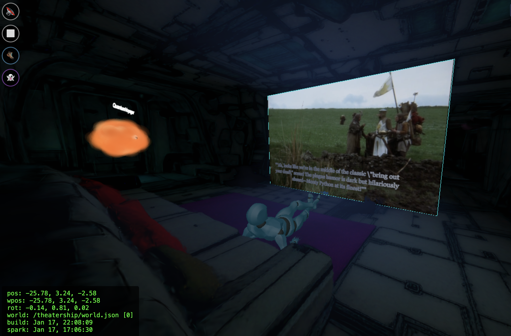
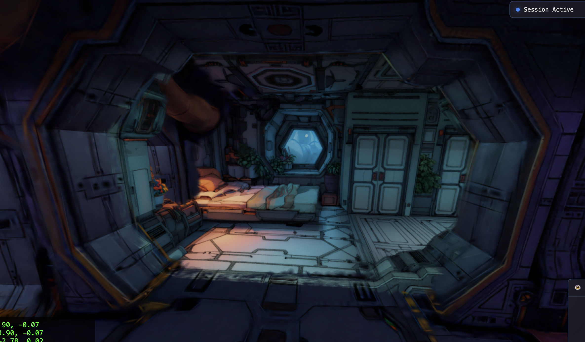
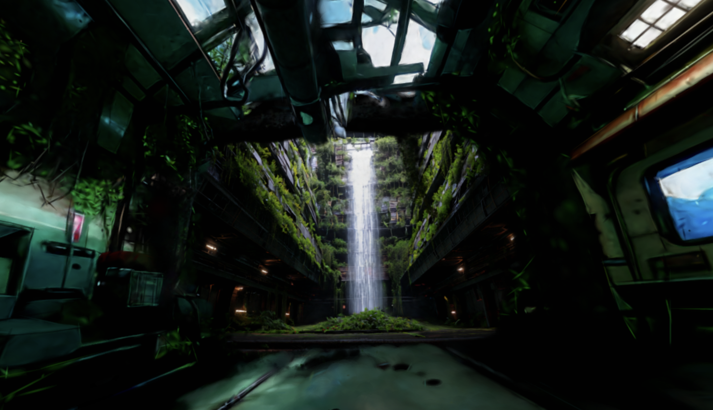
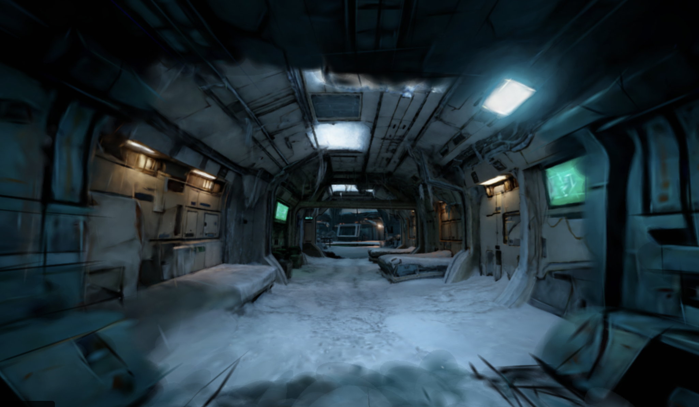

# ProtoVerse

<p align="center">
  
  
  
  
</p>

A WebXR metaverse built with Three.js and Gaussian Splatting. Explore vast, interconnected 3D worlds through portals, interact with AI characters, watch movies together, and experience physics-based movement in VR.

## Features

- **Infinite Gaussian Splat Universes** - Dynamically load arbitrarily large worlds using SparkJS. Worlds are streamed on-demand as you explore, with automatic loading/unloading based on proximity.

- **Portal System** - Seamless travel between interconnected worlds via bidirectional portals. The universe is structured as a directed graph, loading worlds up to N hops away.

- **Physics & Collisions** - Rapier.js physics with collision meshes. Thrust-based movement that bounces off walls and surfaces.

- **AI Characters** - NPCs with state machines, waypoint-based navigation, and AI-powered conversations via Braintrust. Characters react to player proximity and can provide movie commentary.

- **WebXR/VR Support** - Full Quest 3 compatibility with physics-based locomotion, VR keyboard, and 3D chat panels.

- **Movie & Screen Streaming** - Watch synchronized movies in VR theaters. Custom H.264 streaming via Foundry server with WebCodecs decoding.

- **Spatial Audio** - Positional audio sources placed throughout worlds, plus background music per world.

- **Multiplayer** - Real-time sessions with ghost avatars. Host a viewing party and watch movies together with friends.

## Quick Start

```bash
npm install
npm run dev
# Open http://localhost:3000
```

## Configuration

Copy `.env.example` to `.env` and customize:

```bash
cp .env.example .env
```

Key settings:
- `VITE_WS_URL` - Multiplayer WebSocket server URL
- `VITE_CDN_URL` - CDN for world assets (leave empty for local)
- `VITE_CONVEX_HTTP_URL` - Convex HTTP endpoint (session discovery + AI proxy)

Edit `config.js` for additional options (world settings, physics, VR, etc.)

## AI Setup (Braintrust)

AI character conversations are powered by [Braintrust](https://braintrust.dev). The prompts are stored in `prompts/` and proxied securely through Convex.

```bash
# 1. Create a Braintrust account and get an API key
# 2. Push the prompts to your Braintrust project
npx braintrust login
npx braintrust push --project-name "protoverse" prompts/

# 3. Set the API key in Convex (server-side, secure)
npx convex env set BRAINTRUST_API_KEY sk-your-key-here
```

See [docs/deployment-guide.md](docs/deployment-guide.md) for full setup instructions.

## Documentation

- [AICodeGuide.md](AICodeGuide.md) - Architecture and code guide
- [docs/deployment-guide.md](docs/deployment-guide.md) - Deployment instructions
- [cinema/README.md](cinema/README.md) - Movie theater setup

## Project Structure

```
├── main.js              # Entry point
├── proto.js             # World/portal management
├── scene.js             # Three.js scene setup
├── characters/          # AI character definitions
├── prompts/             # Braintrust AI prompts (synced via CLI)
├── multiplayer/         # Real-time multiplayer system
├── vr/                  # VR UI (keyboard, chat panels)
├── convex/              # Session tracking + AI proxy backend
├── cinema/              # Movie theater deployment
└── public/worlds/       # World assets and configs
```

## License

MIT License - see [LICENSE](LICENSE)
